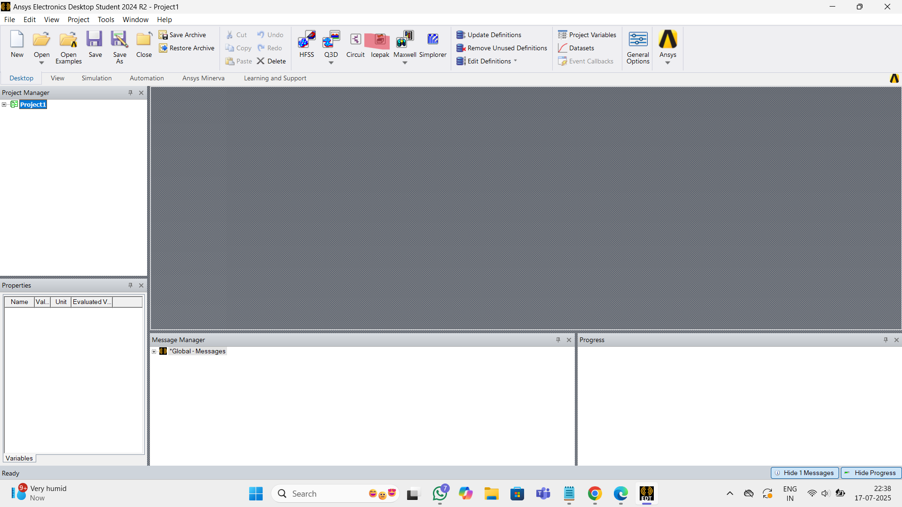
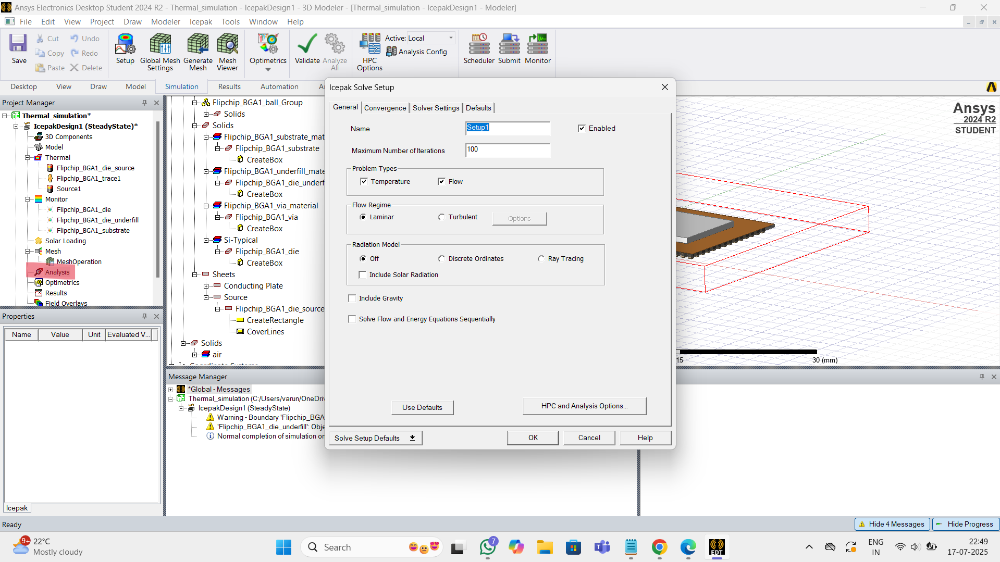
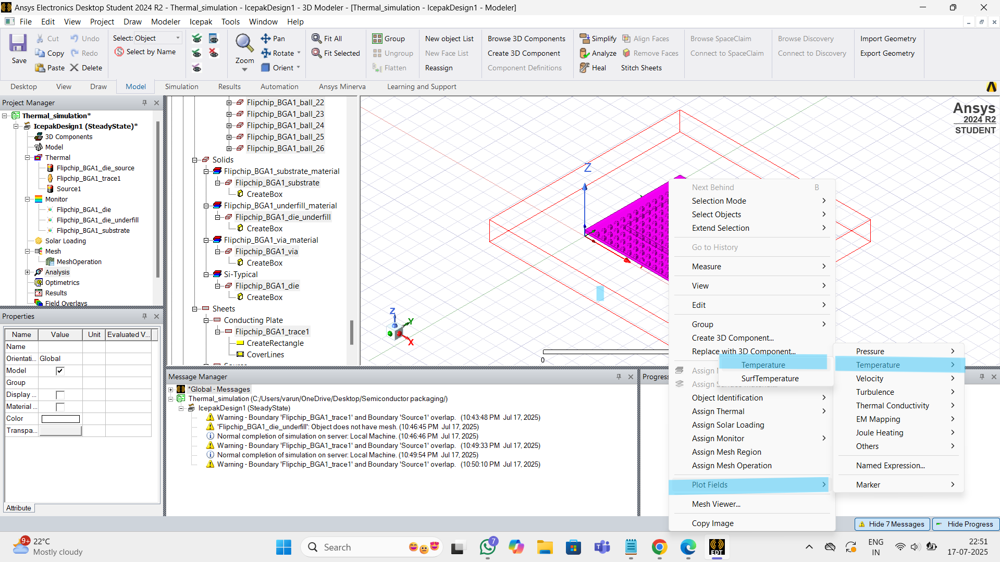
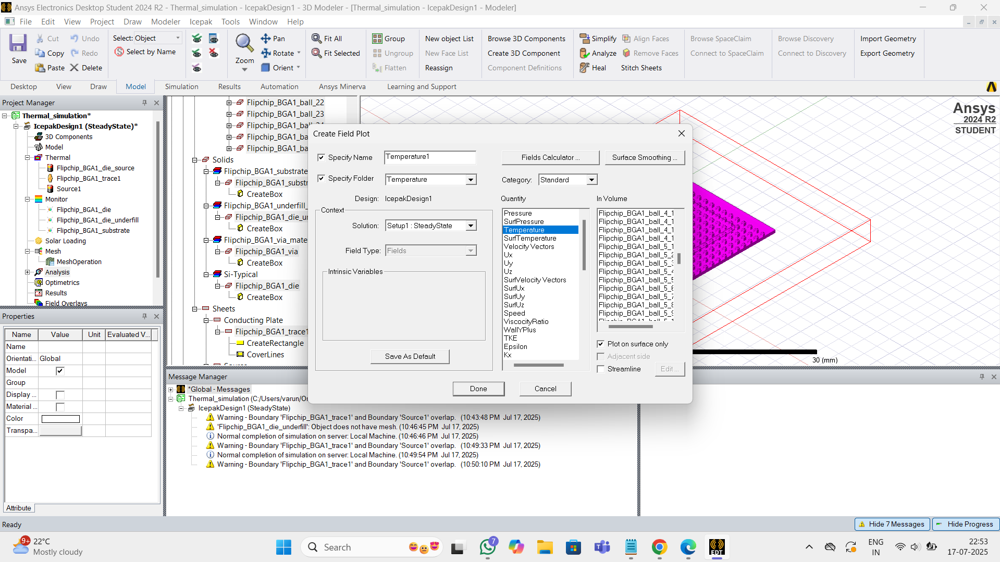

# Semiconductor-Packaging

## 1 - Packaging Evolution: From Basics to 3D Integration
Semiconductor packaging is the process of transforming fragile silicon dies into durable, functional components that power real-world electronics. This document explores **why packaging is essential** and how it connects the foundry to final product.

The key functions of a semiconductor package are:

 **- Protection**: Shields silicon die from mechanical, thermal, and chemical threats.  
 **- Electrical Bridging**: Routes signals between silicon and PCB.  
 **- Thermal Management**: Transfers heat away from the die.  
 **- Mechanical Integrity**: Provides physical support during system integration.

### 1.A - Introduction To Semiconductor Packaging And Industry Overview

|  |
|:---:|

##  1. Protected Environment:
Semiconductor dies originate from major foundries:
- **TSMC**
- **Samsung**
- **Micron**
- **SK Hynix**
- **Intel**
  
These bare dies are **fragile** and require packaging to survive physical, chemical, and thermal stresses.
  
##  2. Preparing the Die for the Real World:
Packaging serves two primary functions:

**(i) Protection:**
- Shields against **corrosion**
- Prevents **moisture intrusion**
- Guards from **mechanical damage**

**(ii) Connectivity:**
- Enables **die-to-die communication**
- Bridges to the **external world**

Common Packaging Example: Ball Grid Array (BGA)

| Component         | Purpose                                                  |
|------------------|-----------------------------------------------------------|
| **Die Attach**        | Secures the die to substrate                        |
| **Molding Compound**  | Encapsulates and protects the die                   |
| **Wire Bond**         | Links die to substrate pathways                     |
| **Substrate**         | Base layer for routing signals and power            |
| **Trace**             | Conductive lines for signal transmission            |

The following figure shows how these steps fit into the overall semiconductor manufacturing process.

|  |
|:---:|

_Ref:_ [_SK Hynix Newsroom: Semiconductor Back-End Process Episode 3_](https://news.skhynix.com/semiconductor-back-end-process-episode-1-understanding-semiconductor-testing/)

  | Role               | Function                                  | Examples               |
|-------------------|-------------------------------------------|------------------------|
| **Fabless**        | Chip design only                          | Nvidia, Qualcomm       |
| **Foundries**      | Wafer manufacturing                      | TSMC, GlobalFoundries  |
| **OSATs**          | Assembly and Testing                     | ASE, Amkor, JCET       |
| **IDMs**           | Full-stack production                    | Intel, Samsung, Micron |

### 1.B - Understanding Package Requirements And Foundational Package Types
#### 1.B.1 - Package Requirements
Selecting the right semiconductor package is a critical step in electronic system design, as it affects performance, cost, thermal management, size, and reliability. 

|  |
|:---:|

## System Hierarchy: Chip → Package → Board

- **Chip**: The smallest and most fundamental unit, representing the processed die that performs specific tasks like logic, memory, or power delivery.
- **Package**: Interfaces between the chip and board, enabling electrical connection, environmental protection, and mechanical support.
- **Board**: The printed circuit board (PCB) that hosts multiple packages and connects them into a functioning system.

## Functional Breakdown:

| Component | Role in System               | Key Functions                                  |
|-----------|------------------------------|------------------------------------------------|
| Chip      | Core Processing Element       | Executes logic, stores data, manages power     |
| Package   | Interface Layer               | Electrically connects chip to board; provides protection |
| Board     | Integration Platform          | Hosts multiple packaged chips; manages interconnects |

---
 ## How to Choose the Right Package?

**1. Application Type:**    
- Typical categories:
  - Logic (e.g., microprocessors, controllers)
  - Memory (DRAM, Flash)
  - Power (Power Management ICs)

**2. Pin Count (I/O Complexity):**  
- Number of input/output connections required  
- Affects package size, layout, and signal routing complexity

**3. Form Factor:**
- Physical dimensions, height, and footprint  
- Influences thermal characteristics and system compactness

**4. Reliability & Durability:**
- How resistant is the package to environmental stresses?  
- Factors include moisture sensitivity, vibration, and aging

**5. Cost:**  
- Bill of materials (BOM) and manufacturing considerations  
- Trade-offs between advanced packaging vs. budget limits

**6. Thermal Dissipation:** 
- Depends on thermal interface materials and design

#### 1.B.2 - Typical Package Structure
The following figure below shows the structure of a typical chip package and the connection hierarchy:

|  |
|:---:|

##  Typical Semiconductor Package Structure

A typical semiconductor package serves as the **bridge between the die and the system board**, ensuring electrical connectivity, physical protection, and thermal management. Below is a detailed breakdown of its layered construction:

| Layer                        | Description                                                                 |
|-----------------------------|-----------------------------------------------------------------------------|
| **Mold Compound**           | Outer shell that encapsulates and protects the package from environmental damage such as moisture, dust, and mechanical shock. Typically made of epoxy resin. |
| **Die (Chip)**              | The silicon-based microelectronic component that performs the actual computing or sensing function. Can be logic, memory, analog, or mixed-signal. |
| **Die-to-Carrier Interconnects** | Tiny conductive links that connect the die to the carrier. Methods include: wire bonding, flip-chip bumps, or solder balls. Determines electrical performance and reliability. |
| **Carrier (Substrate)**     | Physical platform that supports the die and routes electrical signals. Can be fabricated from various materials including: leadframe, organic laminate, ceramic, silicon, or glass. |
| **Carrier-to-Board Interconnects** | Conductive pathways that link the carrier to the system board (PCB). Common formats include solder balls, land grid arrays, and pins. This ensures power and signal transfer to/from the chip. |
| **System Board (PCB)**      | The printed circuit board onto which the package is mounted. Hosts multiple packages and components, forming the complete electronic system. |

---

## Material Options for Carrier

| Material        | Characteristics                                   | Typical Usage                        |
|----------------|---------------------------------------------------|--------------------------------------|
| Leadframe      | Metal-based, economical                           | Simple discrete devices              |
| Laminate        | Organic layers with copper routing                | Consumer electronics and mobile SoCs |
| Plastic         | Cost-effective molding                            | Entry-level ICs                      |
| Ceramic         | Excellent thermal and electrical properties       | High-reliability, military, aerospace|
| Organic RDL     | Redistribution layers, compact, flexible          | Advanced packaging                   |
| Silicon         | High-density interconnect and precision           | Chiplets and 2.5D/3D integration     |
| Glass           | Emerging material with high-density routing       | Future advanced packages             |

---
## Mounting Technologies - Semiconductor Packaging

This table categorizes different mounting technologies used in semiconductor packaging, with brief examples to illustrate real-world applications.

| Category                  | Package Type        | Full Form / Description                                   | Example Use Cases                                     |
|--------------------------|---------------------|-----------------------------------------------------------|--------------------------------------------------------|
| **Through-hole Mounting**| TO                  | Transistor Outline                                        | Discrete transistors                                  |
|                          | SIP                 | Single In-line Package                                    | Basic logic chips                                     |
|                          | DIP                 | Dual In-line Package                                      | Microcontrollers, EEPROMs                      |
|                          | PGA                 | Pin Grid Array                                            | CPUs, socketed processors                       |
| **Surface Mount Technology**|  SOIC                | Small Outline Integrated Circuit                          | Logic ICs, op-amps                                    |
|                          | QFN                 | Quad Flat No-leads                                        | RF chips                                     |
|                          | QFP                 | Quad Flat Package                                         | Microcontrollers, DSPs                               |
|                          | PBGA                | Plastic Ball Grid Array                                   | General-purpose processors                            |
|                          | LGA                 | Land Grid Array                                           | High-density CPUs, FPGAs                              |
|                          | FCBGA               | Flip Chip Ball Grid Array                                 | High-end GPUs, AI chips                               |
|                          | CSP                 | Chip Scale Package                                        | Mobile SoCs, wearable electronics                     |                         
| **Advanced Packages**    | CoWoS                 |  Chip-on-Wafer-on-Substrate                                    | Nvidia GP100, GV100, GA100    |
|                          | MCM                 | Multi-Chip Module                                         | Intel Broadwell, multi-functional ICs                 |
|                          | SiP                 | System-in-Package                                         | Apple S1                        |
|                          | PoP              | Package on Package                               |  Qualcomm SD series, Apple A-series,Samsung Exynos         |

### 1.C - Evolving Package Architectures - From Single Chip To Multi-Chip Modules
#### 1.C.1 Classification and Anatomy of Semiconductor Packages:

|  |
|:---|
| _Ref:_ [_SK Hynix Newsroom: Semiconductor Back-End Process Episode 3_](https://news.skhynix.com/semiconductor-back-end-process-episode-3-understanding-the-different-types-of-semiconductor-packages/)_ |

**1. Conventional Packages:**
Conventional packages are traditional forms of IC packaging that rely on post-fabrication encapsulation. They are broadly divided by the material used:

**A. Plastic Packages:**
Plastic packages dominate cost-sensitive and high-volume applications.

| Subtype            | Description                                     |
|--------------------|-------------------------------------------------|
| **Leadframe Type** | Uses a metal leadframe for mechanical support and electrical I/O. Common in DIP, SOP, QFP. |
| **Substrate Type** | Utilizes multilayer substrates with embedded wiring. Found in BGA, CSP formats. |

**B. Ceramic Packages:**
Used in high-reliability systems such as aerospace and defense.

| Subtype        | Description                                     |
|----------------|-------------------------------------------------|
| **Ceramic Type**| Excellent thermal and electrical properties. Hermetically sealed. Examples: CERDIP, CPGA. |

---

**2. Wafer-Level Packages:**
Wafer-Level Packaging (WLP) involves packaging the die at the wafer level before singulation. These modern formats offer compact size and high performance.

**A. WLCSP - Wafer-Level Chip Scale Package:**

| Variant        | Description                                                                   |
|----------------|-------------------------------------------------------------------------------|
| **Fan-In WLCSP** | Interconnects are routed within the die’s footprint. Ideal for compact form factors. |
| **Fan-Out WLCSP** | Redistributes connections beyond the die’s boundary. Enables higher I/O count and functionality. |

**B. RDL - Redistribution Layer:**

| Description                                    |
|------------------------------------------------|
| Adds routing layers on top of the die to reorganize I/O pads. Often used with WLCSP and flip-chip designs. |

 **C. Flip-Chip Packaging:**

| Description                                    |
|------------------------------------------------|
| Die is flipped upside down and bonded directly to the substrate using solder bumps. Enables shorter signal paths and improved electrical performance. |

**D. TSV - Through-Silicon Via:**

| Description                                    |
|------------------------------------------------|
| Vertical electrical interconnects that pass through the silicon wafer. Enables 3D stacking and high-bandwidth interconnect between dies. |

---

### Package Anatomy:

|  |
|:---|

### 1.D - Interposers, RDLs And 2.5D and 3D Packaging Approaches:

|  |
|:---|

The nomenclature begins with the **die or chip structure** - ranging from single die to complex multi-chip solutions:

 **1. Die-Level Variants:**

| Configuration     | Description                                                                 |
|-------------------|-----------------------------------------------------------------------------|
| **Single Chip**   | A single die processed and packaged independently                          |
| **Multichip**     | Multiple dies mounted on a common substrate or interconnected              |

**Multichip Types:**

| Type                     | Description                                                                 |
|--------------------------|-----------------------------------------------------------------------------|
| **Thin-Film**            | Passive interconnect layer using deposited thin films                      |
| **TSV-less Interposer**  | Organic/inorganic interposer with no Through-Silicon Vias (TSVs)           |
| **Passive TSV Interposer** | Interposer with TSVs but no active components                            |
| **Active TSV Interposer** | Includes active circuitry (e.g., power management, routing logic)         |

---

**2. Package Substrate Classification**
Packages are categorized based on the substrate used and their dimensional integration level:

**A. Substrate Technology:**

| Type             | Description                                                               |
|------------------|---------------------------------------------------------------------------|
| **COB (Chip on Board)** | Die directly mounted on a PCB with wire bonding or flip-chip          |
| **PBGA (Plastic Ball Grid Array)** | Organic substrate with solder balls underneath              |
| **fcCSP (Flip-Chip Chip Scale Package)** | Die flipped and connected via solder bumps on compact substrate |

---

**3. Dimensional Integration Levels:**

| Level     | Description                                                                           |
|-----------|---------------------------------------------------------------------------------------|
| **2D**    | Single die on a single substrate; most conventional format                           |
| **2.1D**  | Enhanced 2D with redistribution layers or simple passive elements                     |
| **2.3D**  | Slightly integrated form with embedded components or stacked passives                 |
| **2.5D**  | Die mounted on a separate interposer with TSVs - increased I/O density                |
| **3D**    | Full vertical stacking of dies interconnected with TSVs - highest performance density |

---
**4. System-Level Integration (PCB Level):**
The final layer of packaging nomenclature refers to how packages interact with the Printed Circuit Board (PCB).

| Integration      | Description                                                                 |
|------------------|-----------------------------------------------------------------------------|
| **Direct Mount** | COB-style direct die-to-board bonding                                      |
| **Socketed**     | PGA or LGA packages where the chip is inserted via physical sockets         |
| **SMD (Surface-Mounted Devices)** | Packages soldered directly onto PCB pads (e.g., BGA, QFN, CSP)      |
| **Stacked Packages** | Vertically mounted multiple packaged dies - PoP style integration         |

---

### 1.E - Comparative Analysis And Selecting The Right Packaging Solution

|  |
|:---|

_________________________________________________________________________________________________________  

## 2 - From Wafer to Package: Assembly and Manufacturing Essentials
The module-2 covers the semiconductor supply chain and provides a detailed look into a package manufacturing unit (**ATMP** – Assembly, Testing, Marking, and Packaging).

### 2.A - Setting The Stage - Supply Chain And Facilities
#### 2.A.1 - Semiconductor Supply Chain Overview

|  |
|:---|

**1. Design House:**
- It is responsible for turning concepts into manufacturable digital architectures.

A. Core Functions:
- Develop digital blueprints for ICs using **EDA (Electronic Design Automation)** tools.
- Incorporate physical design kits (**PDKs**) from foundries to ensure compatibility with manufacturing rules.
- Produce the **GDSII (Graphic Data System II)** layout file, which represents the geometric patterns used to etch transistors and interconnects on silicon.

B. Outputs:
- Verified IC design files
- Associated test program specifications
- Design constraints optimized for performance, power, and area (PPA)

This stage is entirely virtual but foundational. It determines the capabilities and commercial competitiveness of the chip. The output sets the stage for wafer fabrication.

---

**2. Wafer Fabrication Stage:**

Once the digital design is finalized, it moves to **wafer fabrication**, conducted by semiconductor foundries such as **TSMC**, **Samsung**, or **Intel**.

A. Raw Inputs:
- **Silicon wafers**: Pure monocrystalline discs that form the physical base of ICs.
- **Process gases and chemicals**: Used for etching, doping, and deposition.
- **Photolithography equipment**: For pattern projection using EUV or DUV light.

B. Core Processes:
- Photolithography
- Etching
- Ion implantation
- Deposition
- Chemical mechanical polishing (CMP)

C. Output:
- Processed silicon wafers with densely packed dies
- Test markers and alignment keys for downstream inspection

Fabrication often spans hundreds of steps over several weeks, building transistors layer by layer at nanometer scales.

---

**3. Package Assembly & Test Stage:**
Dies are cut (singulated) from wafers and transitioned to **packaging and electrical testing**.

A. Materials Utilized:
- Substrates (organic/ceramic)
- Epoxy molding compounds
- Wire bonding or flip-chip interconnects
- Lids or heat spreaders

B. Assembly Functions:
- Attaching the die to the substrate
- Routing signals via wire bonds or solder bumps
- Encapsulation using mold compound
- Electrical testing using automated handlers

C. Output:
- Fully packaged and electrically validated dies
- Marked components (e.g., labeled “A15” for Apple’s processor)

The packaging step ensures both **protection** and **connectivity**, effectively giving the chip a body.

---

**4. Board Assembly & Test Stage:**
Packaged dies are mounted onto **printed circuit boards (PCBs)**, forming functional platforms.

A. Materials & Tools:
- Multi-layer PCBs
- Solder paste and reflow ovens
- Placement robots

B. Processes:
- Surface-mount technology (SMT) placement
- Reflow soldering
- Functional and in-circuit testing

This phase integrates discrete functions into unified systems such as smartphones, wearables, or compute modules.

---
**5. Product Assembly & Test Stage:**
The final destination is **product-level integration**, where fully assembled boards are placed into physical enclosures and subjected to rigorous testing.

A. Components Used:
- Mechanical housing
- Display, battery, camera module, input sensors
- Antennas and structural adhesives

B. Testing Protocols:
- Burn-in testing
- Environmental stress screening
- Final software flashing and validation
---

#### 2.A.2 - Introduction to a Package Manufacturing Unit (ATMP)
The ATMP process involves four core activities: Assembly, Testing, Marking, and Packaging.
The ATMPs could be OSATs (like ASE, Amkor, TATA etc.) or in-house ATMPs of IDMs (like Intel, Samsung, Micron) or Foundries (like TSMC, Samsung Foundry)

| **Typical layout of an ATMP:**    |
|:---|

## ATMP Facility Layout:

| **Zone**                  | **Function & Activities**                                                                                     |
|--------------------------|--------------------------------------------------------------------------------------------------------------|
| **Offices**            | - Engineering process control and diagnostics    - Management & production scheduling   - Quality assurance (defect tracking, compliance)   - Includes conference rooms, design review areas, secure IT systems |
| **Material Preparation & Storage** | - Receives dies, substrates, leadframes, packaging materials   - Staging for traceability & workflow   - Moisture Sensitivity Level (MSL) management   - ESD-safe, temperature/humidity controlled storage |
| **Processing Zone (Cleanroom – ISO Class 6 & 7)** | - Core packaging operations:     - Die attach (epoxy or solder bonding)     - Wire bonding (gold, copper, aluminum wires)     - Flip-chip interconnect     - Encapsulation & molding     - Redistribution Layer (RDL) creation   - Uses bonder heads, vacuum ovens, plasma tools |
| **Testing Area**       | - Electrical testing via Automated Test Equipment (ATE)   - Burn-in stress testing (high temp/voltage)   - Reliability chambers for thermal cycling, humidity, vibration   - Custom test setups for product families |
| **Warehouse**          | - Stores packaged ICs ready for shipping   - Manages spare parts, substrates, labels   - Segregates good, reject, and rework lots   - Climate controlled for sensitive devices |
| **Utility & Maintenance Room** | - Supports facility infrastructure   - HVAC & cleanroom airflow control   - DI water systems for cleaning   - Maintenance tools, spare modules   - Emergency backup & safety systems |

### 2.B - Wafer Pre-Preparation - Grinding And Dicing

|  |
|:---|

## Cleanroom Process Flow - Wafer Preparation Steps

**1. Incoming Wafer Carrier:**
- Wafers arrive stacked inside **protective carriers** designed to prevent contamination and mechanical damage.
- Carriers maintain electrostatic discharge (ESD) safety, and are classified for cleanroom ingress protocols.
- Often made from high-grade polymers with compartments for 25 wafers per lot.

---
**2. Wafer Inspection:**
- Initial **visual and automated inspection** is performed to screen for defects such as:
  - Scratches
  - Warping
  - Residue from prior processes
- Systems may use optical microscopes or machine vision algorithms to detect surface anomalies.
- Defective wafers are flagged for rework or rejected to avoid yield impact downstream.

---
**3. Wafer Front Tape Lamination:**
- A specialized adhesive **protective tape** is applied to the front (active) surface of the wafer.
- Purpose:
  - Shields the active layer during backside grinding and handling
  - Prevents debris contamination and surface cracking
- Lamination performed with uniform tension and bubble-free adhesion using rollers or lamination chambers.
- Tape materials include UV-curable polymer films that allow safe removal post-dicing.

---
**4. Wafer Backside Grinding:**
- The wafer’s **backside is ground** to reduce thickness, which:
  - Facilitates die placement in compact packages
  - Improves thermal management in stacked packages
- Tool configuration:
  - High-speed **rotating spindle**
  - **Grinding wheel** designed for low-damage planarization
- Thickness reduction typically ranges from hundreds to tens of microns with submicron control.

---
**5. Mounting to Tape Frame (Backside):**
- Ground wafer is mounted onto a **tape frame** that:
  - Provides mechanical support during dicing
  - Holds the wafer taut to enable precise cutting
- Tape is stretched over a metal ring frame and the wafer is aligned using fiducial markers.
- UV-sensitive or thermal-release adhesive tapes are used for easy die pickup after singulation.

---
**6. Two-Step Wafer Dicing:**
A hybrid approach that maximizes accuracy and throughput:

 **A. Laser Grooving:**
- Prepares the wafer by forming **microtrenches** at die-separation boundaries.
- Minimizes chipping and creates predictable fracture lines.
- Laser wavelength and focus tuned to silicon depth and material reflectivity.

 **B. Blade Dicing:**
- Mechanical blade slicing completes the die separation process.
- Blades move precisely along the grooved paths created earlier.
- Die debris is managed via cooling fluid or vacuum suction systems.
- Final diced units remain adhered to the tape frame for downstream inspection and packaging.
---

**Cleanroom Protocols:**
- All processes occur in **ISO Class 6 and 7 cleanrooms**, with stringent particle control.
- Operators wear full bunny suits and gloves to ensure zero contamination.
- Equipment includes HEPA-filtered laminar flow stations and ESD-safe tools.

---

### 2.C - Wire Bond Packaging - Die Attach To Molding

|  |
|:---|

## Cleanroom Packaging Process - Wire Bond Package Flow
The table is outlining the cleanroom packaging workflow for wire bond semiconductor devices. This process includes key operations from die attach to final molding.

---
|  Step                         |  Description                                                                                                                     |
|--------------------------------|------------------------------------------------------------------------------------------------------------------------------------|
| **Wire Bond Package Overview** | A cross-sectional illustration of a wire bond package structure, showing:  - Mold compound for protection  - Die (IC chip)  - Substrate for mechanical and electrical support |
| **Die Attach**                 | Performed in three stages:  - **Epoxy Dispense**: Automated dispensing of adhesive onto the substrate  - **Pick the Die**: The die is selected and aligned by the pick tool  - **Placement**: The die is positioned onto the substrate where adhesive has been applied |
| **Curing**                     | Post die-attach thermal treatment:  - Ensures epoxy hardening and strong adhesion  - Typically involves baking the wafer at specific temperatures over defined durations |
| **Wire Bonding**               | Multi-step interconnection process between die pads and substrate:  - **Wire Clamp**: Secures wire in place  - **Capillary Tip**: Guides wire positioning  - **EFO Spark**: Forms Free Air Ball (FAB) using electrical discharge  -  **Ball Bond**: Bond formed using ultrasound and pressure  - **Wire Loop Formation**: Shapes wire arc to target pad  - **Crescent Bond**: Final termination at substrate  - **Ultrasound + Force**: Mechanical + acoustic energy secures bond |
| **Singulation**                | Wafer or panel is diced into individual units:  - A rotating **dicing blade** cuts across scribe lines  - Minimizes mechanical damage and maintains die integrity |
| **Marking (Laser)**            | Unique identification via laser etching:  - Adds serial numbers, batch IDs, or logos  - Uses controlled laser power and optics to avoid surface degradation |
| **Molding (Transfer Molding)**| Final encapsulation process:  - Mold compound (epoxy-based resin) is injected around the wire bond structure  - Protects the die from mechanical, chemical, and thermal stress  - Executed using precision molds and transfer presses |

---

### 2.D - Flip Chip Assembly - Bump Formation And Underfill
Flip chip packaging enhances electrical performance and I/O density by mounting the die face-down on the substrate.

|  |
|:---|

| **Step**                 | **Description**                                                                                          |
|-------------------------|----------------------------------------------------------------------------------------------------------|
| **Bump Formation**     | - Create solder bumps on die pads via electroplating or screen printing   - Pre-reflow forms uniform hemispherical bumps |
| **Die Flipping**       | - Invert the die so solder bumps face the substrate   - Reduces parasitic inductance and improves thermal paths |
| **Flux Dispensing**    | - Apply flux to substrate pads   - Removes oxidation, promotes solder wetting, and prevents voids |
| **Chip Placement**     | - Use vision alignment systems for precise die placement   - Ensure micrometer-level accuracy |
| **Solder Reflow**      | - Heat in a reflow oven to melt solder bumps   - Forms strong metallurgical joints with substrate |
| **Flux Cleaning**      | - Remove residual flux using solvents or ultrasonic cleaning   - Prevents corrosion and electrical shorts |
| **Underfill Dispensing** | - Dispense underfill material to fill die-substrate gaps   - Enhances mechanical integrity and stress distribution |
| **Underfill Curing**   | - Thermally cure underfill to solidify and secure adhesion   - Prepares the package for thermal cycling |
| **Molding**            | - Encapsulate the die with mold compound via transfer molding   - Protects against environmental factors |
| **Marking**           | - Apply batch codes, logos, or identifiers via laser or ink marking   - Ensures product traceability |

### 2.E - Wafer Level Packaging And Conclusion

Wafer-Level Packaging (WLP) is a technique where the entire packaging process is done at the wafer level, before dicing and offers smaller size, and lower cost.  
There are two main types of WLP:
  - **Fan-in WLP (FI-WLP)** : I/O pads are redistributed within the die area to match the solder bumps.
  - **Fan-out WLP (FO-WLP)** : Uses RDLs to extend the I/O pads beyond the die area, enabling higher I/O density.

**<U>FO-WLP Process</U>**

|  |
|:---|

# Fan-Out Wafer-Level Packaging - Cleanroom Process Flow

| **Process Step**            | **Description**                                                                                          |
|-----------------------------|----------------------------------------------------------------------------------------------------------|
| **Wafer-Level Package Structure** | - **Solder Balls**: Interface to PCB/system board   - **Redistribution Layer (RDL)**: Routes I/O from die to ball grid   - **Epoxy Molding Compound (EMC)**: Encapsulates the die   - **Silicon Chip**: Active electronic component embedded in mold |
| **Die Reconstitution Flow** | - **Die Singulation**: Wafer is diced into known-good dies   - **Pick & Place**: Dies are spaced and placed on a temporary carrier   - **Molding Process**: EMC encapsulates the dies to form a reconstituted wafer; temporary carrier is removed |
| **Redistribution Layer (RDL) Process** | - **Dielectric & Metal Coating**: Polymer dielectric and metal seed layer deposition   - **1st RDL Patterning**: Photolithography and etching for initial traces   - **Intermediate Dielectric Coating**: Insulation between RDL layers   - **2nd RDL Patterning**: Adds power/ground routing   - **3rd RDL Patterning**: Final layer aligns to solder ball pads |
| **Solder Ball Attach**    | - Align and place solder balls on fan-out pads   - Reflow process creates metallurgical connections   - Inspection ensures coplanarity, joint integrity, and electrical continuity |

_________________________________________________________________________________________________________  

## 3 - Labs: Thermal Simulation of Semiconductor Packages with ANSYS tools

### 3.A - Introduction And Getting Started With ANSYS Electronics Desktop

ANSYS Electronics Desktop (AEDT) is a multi-physics simulation software that combines Electromagnetic, Signal Integrity, Thermal and Electro-Mechanical simulation tools in a single integrated platform and it is widely used for designing and analyzing high-speed electronic circuits and systems.

### 3.B - Setting Up A Flip-Chip BGA Package

|  |
|:---|

  - **Step B.1: Create a Flipchip BGA Package**

|  |
|:---|

|  |
|:---|

| |
|:---|

|  |
|:---|

| The Package is generated:    |
|:---|

|  |
|:---|

|  |
|:---|

### 3.C - Material Definitions And Thermal Power Sources

  - **Step C.1: Review and modify the material and definition types for the different components of the model.**

  - **Step C.2: Add or Assign Source Thermal Model for Die**
    - In "Project Manager" sub-window, expand Thermal section and open the "BGA1_die_source" and configure the thermal condition as shown below:

|  |
|:---|

- **Step C.3: Add/ Assign Source Thermal Model for Substrate**
    - To add thermal boundary condition for the substrate, right click on "Flipchip_BGA1_substrate" under "Models -> Flipchip_BGA1_Group -> Solids" and assign a Thermal Source.
    - Set the thermal condition on the substrate to Fixed Temperatue and the temperature as Ambient.

|  |
|:---|

  - **Step C.4: Add Thermal monitors for the different components**
    - To add a Thermal monitor to the substrate, right click on the "Flipchip_BGA1_substrate" under "Models -> Flipchip_BGA1_Group -> Solids" and choose "Assign Monitor -> Point"
    - In the sub-window that appears, select "Temperature"
    - Repeat the same for the die and the die-underfill.

|  |
|:---|

### 3.D - Meshing And Running The Thermal Analysis

  - **Step D.1: Generate Mesh**
    - Go to the Simulation tab and click on "Generate Mesh"
   
  - **Step D.2: Review Mesh Quality metrics**

 **Mesh Quality - Face Alignment**  
 
 **Mesh Quality - Skewness**  

 **Mesh Quality - Volume**  

  - **Step D.3: Add Thermal Analysis**
    - Under "Project Manager", right click on "Analysis and select Add Analysis Setup" and configure the settings as required.
      
 |  |
 |:---|

### 3.E - Viewing Results And Exploring Other Package Types

  - **Step E.1: Validate the Simulation setup**
    - Click on the "Validate" button in the top
    - Ensure all checks are validated

  |  |
|:---|

  - **Step E.2: Run the simulation and plot the temperature map**
    - Click on "Analyze All" button in the top 
    - Wait for the simulation to get completed
    - After the simulation is completed, select the complete FC-BGA package by drawing a rectangle using the left-click button.
    - Right click and then select "Plot Fields -> Temperature -> Temperature"
    - Click on the different plot options:
      - Specify Name and Folder
      - Plot on Surface only
      - Surface Smoothing and click on "Enable Gaussian Smoothing"

|  |
|:---|
 
|  |
|:---|

|  |
|:---|
 
|  |
|:---|

_________________________________________________________________________________________________________  

## 4 - Ensuring Package Reliability: Testing and Performance Validation

### 4.A - Introduction to Package Testing and Electrical Functionality Checks

Integrated Circuits are tested at multiple points during the manufacturing process to ensure performance, reliability, and functionality requirements.

|  |
|:---|

## Semiconductor Testing Stages - Foundry to OSAT Workflow

| **Stage**                  | **Description**                                                                                          |
|---------------------------|----------------------------------------------------------------------------------------------------------|
| **Front-End Manufacturing (Foundry Phase)** | **Process Development**:   - Test wafers used for refining fabrication   - Validate transistor behavior, etching precision, layer uniformity   - Data used for Process Control Monitoring (PCM) and yield improvement |
|                           | **Wafer Probe Test (Sort Test)**:   - Probe stations contact test pads on each die   - Identify good vs. bad dies (KGDs)   - Generate wafer maps with pass/fail status   - Avoids packaging defective dies |
| **OSAT: Back-End Assembly and Test Phase** | **Wafer Sorting**:   - Use wafer maps to guide die singulation   - Sort dies into pass/fail/engineering bins   - Robotic handling & vision inspection |
|                           | **Package Manufacturing**:   - Fine-tune assembly process (die attach, wire bond loop, mold flow)   - Assemble packages using cleanroom protocols |
|                           | **Package Testing**:   - Perform electrical testing for logic, analog, power specs   - Use automated test equipment (ATE) with test handlers   - Conduct burn-in to detect early-life failures |
|                           | **System-Level Testing (SLT)**:   - Place packaged chips in real systems (e.g., smartphones)   - Test boot-up, connectivity, performance under stress   - Detect latent defects not found in earlier tests |

|  | 
|:---|

|  |
|:---|

### 4.B - Reliability and Performance Testing of Semiconductor Packages

#### 4.B.1 Burn-in and Final Test

|  |
|:---|

Burn-in testing aims to detect "Infant Mortality" failures, which occur during the earliest phase of a component’s operational life.
- These failures are typically caused by manufacturing defects, weak dielectric layers, metallization issues, or contamination.
- Burn-in stress conditions accelerate these failure mechanisms using controlled environmental extremes (e.g. temperature, power cycling).
- The goal is to eliminate unreliable devices early and ensure only robust units reach customers.
  
---
**Process Description:**

1. **Loading Devices:**  
   - Semiconductor packages are placed in **trays** that are then mounted onto **Burn-in Boards (BiBs)**.
   - Each BiB contains sockets and power rails configured for stress delivery.

2. **Oven Testing (Burn-in System):**  
   - The BiBs are inserted into **Burn-in ovens** - chambers calibrated to maintain high temperature and voltage conditions.
   - Tests are executed for a duration long enough to observe failure rate changes, but short enough to avoid total component degradation.

3. **Failure Acceleration:**  
   - High voltage and high temperature leads to quicker emergence of defects like:
     - Dielectric breakdown
     - Electromigration
     - Interconnect corrosion
   - Devices showing signs of failure during burn-in are automatically marked or removed.

---
**Failure Rate vs Time Profile:**

The characteristic failure curve during Burn-in resembles the **Bathtub Curve**, composed of three phases:

- **Infant Mortality Region:**  
  - Steep decline in failure rate over time  
  - Burn-in tests are targeted here to screen these defects

- **Useful Life Region:**  
  - Flat section of the curve — indicates low, random failure rates  
  - Devices surviving Burn-in likely reside in this zone

- **Wear-Out Region:**  
  - Failure rate increases due to aging effects like fatigue or thermal cycling  
  - Occurs far later in the lifecycle

The **observed failure rate curve** is shaped by the cumulative effect of stress exposure and defect activation.

---
**Trade-Offs of Burn-in Testing:**

- **Advantages**:
  - Filters early failures before shipment
  - Increases customer confidence and warranty reliability
  - Supports field performance benchmarking

- **Disadvantages**:
  - Reduces overall lifespan due to stress-induced aging
  - Adds cost and complexity to manufacturing
  - May not reveal latent defects if duration or profile isn’t calibrated well

---

|  |
|:---|
**Final Test** - Validates ICs under extreme temperature conditions   - Screens for thermal-dependent electrical failures   - Ensures reliability before system-level deployment 
 
**Final Test - Temperature Corner Verification in IC Testing Workflow**

| **Stage**                    | **Description**                                                                                             |
|-----------------------------|-------------------------------------------------------------------------------------------------------------|
| **Hot Test Procedure**    | - Use temperature-controlled handlers (not ovens)   - For LM741:     - **125 °C for LM741 / LM741A**     - **70 °C for LM741C**   - Test parameters: offset voltage, gain linearity, bias current stability |
| **Cold Test Procedure**   | - Use handler to apply low-temp conditions   - For LM741:     - **-50 °C for LM741 / LM741A**     - **0 °C for LM741C**   - Look for offset drift, gain reduction, or logic failures |
| **Handler & ATE Setup**   | - **Handler Unit**: Loads DUT into temp-controlled sockets   - **Temperature Control**: Provides heating/cooling zones   - **ATE**: Runs electrical test patterns, captures I/O data, and records binning results |
| **LM741 Test Specs**      | - **Input Offset Voltage**: 1–5 mV   - **Input Bias Current**: 20–200 nA   - **Input Voltage Range**: ±12 to ±13 V   - **Output Swing**: ±12 to ±14 V   - **Operating Temp**: Up to 125 °C   - **Junction Temp**: Up to 150 °C |
| **Importance**            | - Temperature corner testing is essential to detect field-related failures   - Guarantees electrical spec compliance across operational extremes |

**Summary: ATE & Test Categories**

|  |
|:---|
_________________________________________________________________________________________________________  

## 5 - Package Design and Modeling: Building a Semiconductor Package from Scratch

This is a hands-on lab to design a semiconductor wire bond package from scratch using Ansys Electronics Desktop (AEDT). 

### 5.A - Introduction to Package Cross-Section Modeling in ANSYS Electronics Desktop (AEDT)

**<U>Package Specifications:</U>**

**1. Die:**
- Material: Silicon
- Dimensions: 3mm × 3mm
- Thickness: 0.2mm

**2. Substrate:**
- Material: FR4_epoxy
- Dimensions: 5mm × 5mm
- Thickness: -0.5mm

**3. Die Attach:**
- Material: Modified_epoxy
- Dimensions: 3mm × 3mm
- Thickness: -0.1mm

**4. Die Bondpad:**
- Material: Copper
- Dimensions: 0.2mm × 0.2mm
- Thickness: 0.005mm

**5. Substrate Bondpad:**
- Material: Copper
- Dimensions: 0.2mm × 0.2mm

**6. Bond Wire:**
- Material: Gold
- Type: JEDEC 4-point configuration

**7. Mold Compound:**
- Material: Epoxy_kevlar_xy
- Thickness: 1.2mm

|  |
|:---|

### 5.B - Creating the Die and Substrate in AEDT

  - **Step B.1: Create the Die Geometry**

|   |
|:---|

| |
|:---|

|  |  
|:---|
 
  - **Step B.2: Create the Substrate Geometry**
    - Draw another rectangle for the substrate (5mm x 5mm) and position (-1, -1, -0.1) 
    - Set the thickness as -0.5mm
      
|  |
|:---|

|  |
|:---|

|  |  
|:---|

### 5.C - Adding Die Attach Material and Bond Pads

  - **Step C.1: Create the Die Attach Material**
    - Draw a rectangle of the same size as that of the die (3mm x 3mm) and at the same co-ordinates (0, 0, 0).
    - Set the thickness to -0.1mm
    - Assign the material to "Modified_epoxy"

|  |
|:---|

|  |
|:---|

|  | 
|:---|

|  |
|:---|

  - **Step C.2: Create Bond pads on Die and Substrate**
  - Draw a rectangle of size (0.2mm x 0.2mm) and position (0.2, 0.2, 0.2) 
  - Set the thickness to 0.005mm

|  |
|:---|

|  |
|:---|

  - Draw a rectangle of size (0.2mm x 0.2mm) on the substrate bondpad and position at (0.2, -0.7, -0.1) 
  - Set the substrate bond pad thickness to 0.01mm

|  |
|:---|

|  |
|:---|

### 5.D - Wire Bond Creation and Material Assignment

  - **Step D.1: Create Bond Wires**
    - Use the Bondwire tool under "Draw"
    - Connect the centre of the Die Bondpad to the centre of the Substrate Bondpad
    - Select the Bondwire type as JEDEC 4-point
    - Assign gold as the Bondwire material

|  |
|:---|

|  |
|:---|

|  |  
|:---|

### 5.E - Applying Mold Compound and Finalizing the Package Model

  - **Step E.1: Build the mold compound**
    - Create a rectangule around the substrate (5mm x 5mm, 1.2mm thickness) and position at (-1, -1, -0.1) 

| | 
|:---|

 |
|:---|

|  | 
|:---|

| |
|:---|

| | 
|:---|

| |
|:---|

| | 
|:---|

_________________________________________________________________________________________________________  
