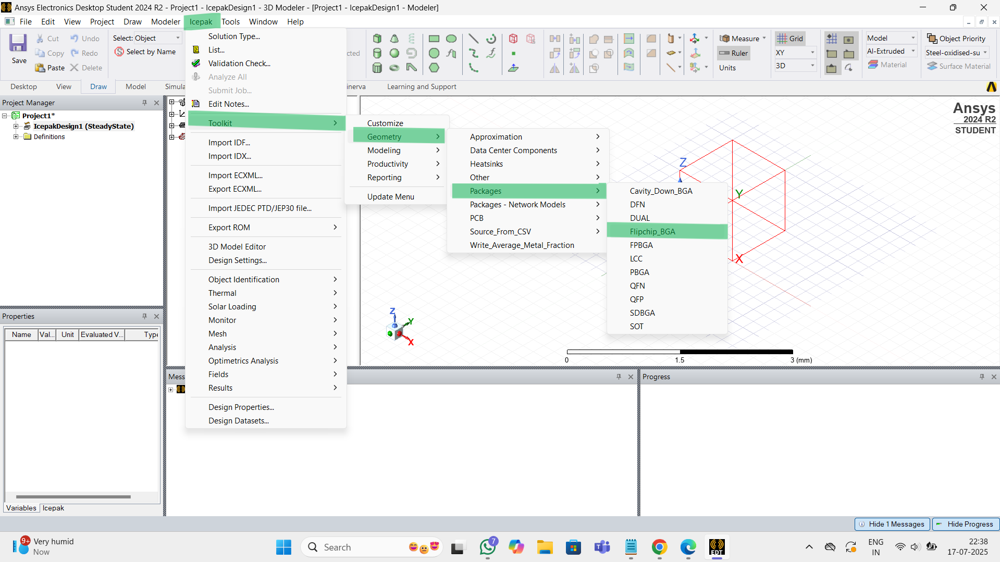
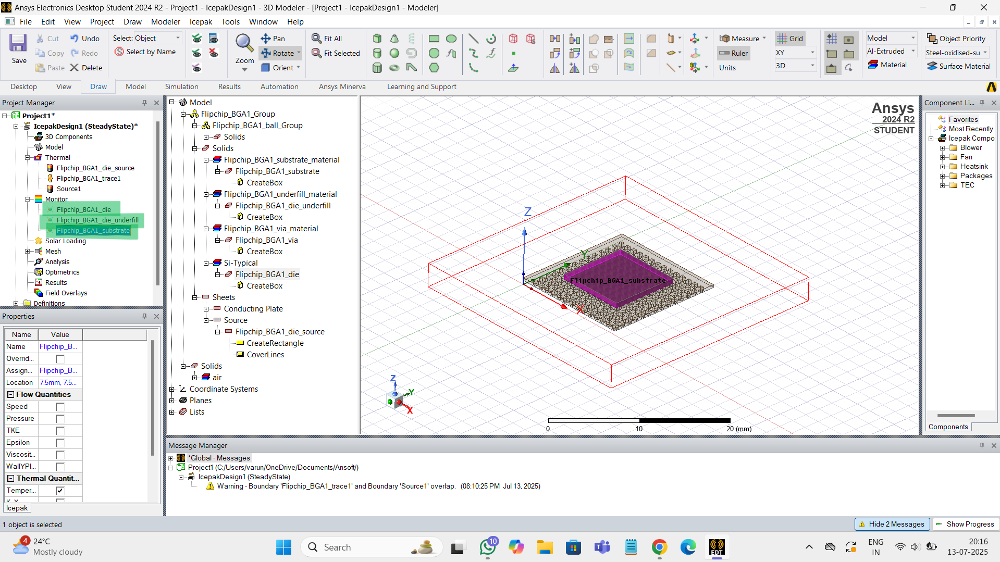

# Semiconductor-Packaging

## 1 - Packaging Evolution: From Basics to 3D Integration
Semiconductor packaging is the process of transforming fragile silicon dies into durable, functional components that power real-world electronics. This document explores **why packaging is essential** and how it connects the foundry to final product.

The key functions of a semiconductor package are:
- **1. Protection**: Shields silicon die from mechanical, thermal, and chemical threats.  
- **2. Electrical Bridging**: Routes signals between silicon and PCB.  
- **3. Thermal Management**: Transfers heat away from the die.  
- **4. Mechanical Integrity**: Provides physical support during system integration.

### 1.A - Introduction To Semiconductor Packaging And Industry Overview
 

|  |
|:---:|

##  1. Protected Environment:
Semiconductor dies originate from major foundries:
- **TSMC**
- **Samsung**
- **Micron**
- **SK Hynix**
- **Intel**
  
These bare dies are **fragile** and require packaging to survive physical, chemical, and thermal stresses.
  
##  2. Preparing the Die for the Real World:
Packaging serves two primary functions:

**(i) Protection:**
- Shields against **corrosion**
- Prevents **moisture intrusion**
- Guards from **mechanical damage**

**(ii) Connectivity:**
- Enables **die-to-die communication**
- Bridges to the **external world**

Common Packaging Example: Ball Grid Array (BGA)

| Component         | Purpose                                                  |
|------------------|-----------------------------------------------------------|
| **Die Attach**        | Secures the die to substrate                        |
| **Molding Compound**  | Encapsulates and protects the die                   |
| **Wire Bond**         | Links die to substrate pathways                     |
| **Substrate**         | Base layer for routing signals and power            |
| **Trace**             | Conductive lines for signal transmission            |

The following figure shows how these steps fit into the overall semiconductor manufacturing process.

|  |
|:---:|

_Ref:_ [_SK Hynix Newsroom: Semiconductor Back-End Process Episode 3_](https://news.skhynix.com/semiconductor-back-end-process-episode-1-understanding-semiconductor-testing/)

  | Role               | Function                                  | Examples               |
|-------------------|-------------------------------------------|------------------------|
| **Fabless**        | Chip design only                          | Nvidia, Qualcomm       |
| **Foundries**      | Wafer manufacturing                      | TSMC, GlobalFoundries  |
| **OSATs**          | Assembly and Testing                     | ASE, Amkor, JCET       |
| **IDMs**           | Full-stack production                    | Intel, Samsung, Micron |

### 1.B - Understanding Package Requirements And Foundational Package Types
#### 1.B.1 - Package Requirements
Selecting the right semiconductor package is a critical step in electronic system design, as it affects performance, cost, thermal management, size, and reliability. 

|  |
|:---:|

## System Hierarchy: Chip → Package → Board

- **Chip**: The smallest and most fundamental unit, representing the processed die that performs specific tasks like logic, memory, or power delivery.
- **Package**: Interfaces between the chip and board, enabling electrical connection, environmental protection, and mechanical support.
- **Board**: The printed circuit board (PCB) that hosts multiple packages and connects them into a functioning system.

## Functional Breakdown:

| Component | Role in System               | Key Functions                                  |
|-----------|------------------------------|------------------------------------------------|
| Chip      | Core Processing Element       | Executes logic, stores data, manages power     |
| Package   | Interface Layer               | Electrically connects chip to board; provides protection |
| Board     | Integration Platform          | Hosts multiple packaged chips; manages interconnects |

---
 ## How to Choose the Right Package?

**1. Application Type:**  
- What is the chip used for?  
- Typical categories:
  - Logic (e.g., microprocessors, controllers)
  - Memory (DRAM, Flash)
  - Power (Power Management ICs)

**2. Pin Count (I/O Complexity):**  
- Number of input/output connections required  
- Affects package size, layout, and signal routing complexity

**3. Form Factor:**
- Physical dimensions, height, and footprint  
- Influences thermal characteristics and system compactness

**4. Reliability & Durability:**
- How resistant is the package to environmental stresses?  
- Factors include moisture sensitivity, vibration, and aging

**5. Cost:**  
- Bill of materials (BOM) and manufacturing considerations  
- Trade-offs between advanced packaging vs. budget limits

**6. Thermal Dissipation:** 
- Can the package handle the chip’s heat output?  
- Depends on thermal interface materials and design

#### 1.B.2 - Typical Package Structure
The following figure below shows the structure of a typical chip package and the connection hierarchy:

|  |
|:---:|

##  Typical Semiconductor Package Structure

A typical semiconductor package serves as the **bridge between the die and the system board**, ensuring electrical connectivity, physical protection, and thermal management. Below is a detailed breakdown of its layered construction:

| Layer                        | Description                                                                 |
|-----------------------------|-----------------------------------------------------------------------------|
| **Mold Compound**           | Outer shell that encapsulates and protects the package from environmental damage such as moisture, dust, and mechanical shock. Typically made of epoxy resin. |
| **Die (Chip)**              | The silicon-based microelectronic component that performs the actual computing or sensing function. Can be logic, memory, analog, or mixed-signal. |
| **Die-to-Carrier Interconnects** | Tiny conductive links that connect the die to the carrier. Methods include: wire bonding, flip-chip bumps, or solder balls. Determines electrical performance and reliability. |
| **Carrier (Substrate)**     | Physical platform that supports the die and routes electrical signals. Can be fabricated from various materials including: leadframe, organic laminate, ceramic, silicon, or glass. |
| **Carrier-to-Board Interconnects** | Conductive pathways that link the carrier to the system board (PCB). Common formats include solder balls, land grid arrays, and pins. This ensures power and signal transfer to/from the chip. |
| **System Board (PCB)**      | The printed circuit board onto which the package is mounted. Hosts multiple packages and components, forming the complete electronic system. |

---

## Material Options for Carrier

| Material        | Characteristics                                   | Typical Usage                        |
|----------------|---------------------------------------------------|--------------------------------------|
| Leadframe      | Metal-based, economical                           | Simple discrete devices              |
| Laminate        | Organic layers with copper routing                | Consumer electronics and mobile SoCs |
| Plastic         | Cost-effective molding                            | Entry-level ICs                      |
| Ceramic         | Excellent thermal and electrical properties       | High-reliability, military, aerospace|
| Organic RDL     | Redistribution layers, compact, flexible          | Advanced packaging                   |
| Silicon         | High-density interconnect and precision           | Chiplets and 2.5D/3D integration     |
| Glass           | Emerging material with high-density routing       | Future advanced packages             |

---
## Mounting Technologies - Semiconductor Packaging

This table categorizes different mounting technologies used in semiconductor packaging, with brief examples to illustrate real-world applications.

| Category                  | Package Type        | Full Form / Description                                   | Example Use Cases                                     |
|--------------------------|---------------------|-----------------------------------------------------------|--------------------------------------------------------|
| **Through-hole Mounting**| TO                  | Transistor Outline                                        | Discrete transistors                                  |
|                          | SIP                 | Single In-line Package                                    | Basic logic chips                                     |
|                          | DIP                 | Dual In-line Package                                      | Early microcontrollers, EEPROMs                      |
|                          | PGA                 | Pin Grid Array                                            | Older CPUs, socketed processors                       |
| **Surface Mount Technology**|  SOIC                | Small Outline Integrated Circuit                          | Logic ICs, op-amps                                    |
|                          | QFN                 | Quad Flat No-leads                                        | RF chips, sensors                                     |
|                          | QFP                 | Quad Flat Package                                         | Microcontrollers, DSPs                               |
|                          | PBGA                | Plastic Ball Grid Array                                   | General-purpose processors                            |
|                          | LGA                 | Land Grid Array                                           | High-density CPUs, FPGAs                              |
|                          | FCBGA               | Flip Chip Ball Grid Array                                 | High-end GPUs, AI chips                               |
|                          | CSP                 | Chip Scale Package                                        | Mobile SoCs, wearable electronics                     |                         
| **Advanced Packages**    | PoP                 | Package on Package                                        | Qualcomm SD series, Apple A-series, Samsung Exynos    |
|                          | MCM                 | Multi-Chip Module                                         | Intel Broadwell, multi-functional ICs                 |
|                          | SiP                 | System-in-Package                                         | Apple S1 (used in Apple Watch)                        |
|                          | CoWoS               | Chip-on-Wafer-on-Substrate                                | Nvidia GP100, GV100, GA100 — used in AI/HPC           |

### 1.C - Evolving Package Architectures - From Single Chip To Multi-Chip Modules
#### 1.C.1 Classification and Anatomy of Semiconductor Packages:

|  |
|:---|
| _Ref:_ [_SK Hynix Newsroom: Semiconductor Back-End Process Episode 3_](https://news.skhynix.com/semiconductor-back-end-process-episode-3-understanding-the-different-types-of-semiconductor-packages/)_ |

**1. Conventional Packages:**
Conventional packages are traditional forms of IC packaging that rely on post-fabrication encapsulation. They are broadly divided by the material used:

**A. Plastic Packages:**
Plastic packages dominate cost-sensitive and high-volume applications.

| Subtype            | Description                                     |
|--------------------|-------------------------------------------------|
| **Leadframe Type** | Uses a metal leadframe for mechanical support and electrical I/O. Common in DIP, SOP, QFP. |
| **Substrate Type** | Utilizes multilayer substrates with embedded wiring. Found in BGA, CSP formats. |

**B. Ceramic Packages:**
Used in high-reliability systems such as aerospace and defense.

| Subtype        | Description                                     |
|----------------|-------------------------------------------------|
| **Ceramic Type**| Excellent thermal and electrical properties. Hermetically sealed. Examples: CERDIP, CPGA. |

---

**2. Wafer-Level Packages:**
Wafer-Level Packaging (WLP) involves packaging the die at the wafer level before singulation. These modern formats offer compact size and high performance.

**A. WLCSP - Wafer-Level Chip Scale Package:**

| Variant        | Description                                                                   |
|----------------|-------------------------------------------------------------------------------|
| **Fan-In WLCSP** | Interconnects are routed within the die’s footprint. Ideal for compact form factors. |
| **Fan-Out WLCSP** | Redistributes connections beyond the die’s boundary. Enables higher I/O count and functionality. |

**B. RDL - Redistribution Layer:**

| Description                                    |
|------------------------------------------------|
| Adds routing layers on top of the die to reorganize I/O pads. Often used with WLCSP and flip-chip designs. |

 **C. Flip-Chip Packaging:**

| Description                                    |
|------------------------------------------------|
| Die is flipped upside down and bonded directly to the substrate using solder bumps. Enables shorter signal paths and improved electrical performance. |

**D. TSV - Through-Silicon Via:**

| Description                                    |
|------------------------------------------------|
| Vertical electrical interconnects that pass through the silicon wafer. Enables 3D stacking and high-bandwidth interconnect between dies. |

---

The below figure shows the anatomy of some of the commonly used leadframe and laminate based packages and advanced substrates:

|  |
|:---|

### 1.D - Interposers, RDLs And 2.5D and 3D Packaging Approaches:

|  |
|:---|

The nomenclature begins with the **die or chip structure** - ranging from single die to complex multi-chip solutions:

 **1. Die-Level Variants:**

| Configuration     | Description                                                                 |
|-------------------|-----------------------------------------------------------------------------|
| **Single Chip**   | A single die processed and packaged independently                          |
| **Multichip**     | Multiple dies mounted on a common substrate or interconnected              |

**Multichip Types:**

| Type                     | Description                                                                 |
|--------------------------|-----------------------------------------------------------------------------|
| **Thin-Film**            | Passive interconnect layer using deposited thin films                      |
| **TSV-less Interposer**  | Organic/inorganic interposer with no Through-Silicon Vias (TSVs)           |
| **Passive TSV Interposer** | Interposer with TSVs but no active components                            |
| **Active TSV Interposer** | Includes active circuitry (e.g., power management, routing logic)         |

---

**2. Package Substrate Classification**
Packages are categorized based on the substrate used and their dimensional integration level:

**A. Substrate Technology:**

| Type             | Description                                                               |
|------------------|---------------------------------------------------------------------------|
| **COB (Chip on Board)** | Die directly mounted on a PCB with wire bonding or flip-chip          |
| **PBGA (Plastic Ball Grid Array)** | Organic substrate with solder balls underneath              |
| **fcCSP (Flip-Chip Chip Scale Package)** | Die flipped and connected via solder bumps on compact substrate |

---

**3. Dimensional Integration Levels:**

| Level     | Description                                                                           |
|-----------|---------------------------------------------------------------------------------------|
| **2D**    | Single die on a single substrate; most conventional format                           |
| **2.1D**  | Enhanced 2D with redistribution layers or simple passive elements                     |
| **2.3D**  | Slightly integrated form with embedded components or stacked passives                 |
| **2.5D**  | Die mounted on a separate interposer with TSVs - increased I/O density                |
| **3D**    | Full vertical stacking of dies interconnected with TSVs - highest performance density |

---
**4. System-Level Integration (PCB Level):**
The final layer of packaging nomenclature refers to how packages interact with the Printed Circuit Board (PCB).

| Integration      | Description                                                                 |
|------------------|-----------------------------------------------------------------------------|
| **Direct Mount** | COB-style direct die-to-board bonding                                      |
| **Socketed**     | PGA or LGA packages where the chip is inserted via physical sockets         |
| **SMD (Surface-Mounted Devices)** | Packages soldered directly onto PCB pads (e.g., BGA, QFN, CSP)      |
| **Stacked Packages** | Vertically mounted multiple packaged dies - PoP style integration         |

---

### 1.E - Comparative Analysis And Selecting The Right Packaging Solution
The following table provides a comparison of the various IC package types and their typical applications:

|  |
|:---|

_________________________________________________________________________________________________________  

## 2 - From Wafer to Package: Assembly and Manufacturing Essentials
This section covers the semiconductor supply chain and provides a detailed look into a package manufacturing unit (**ATMP** – Assembly, Testing, Marking, and Packaging).

### 2.1 - Setting The Stage - Supply Chain And Facilities
#### 2.1.1 - Semiconductor Supply Chain Overview
The semiconductor supply chain is a multi-step process that turns raw silicon into complete electronic products. The main steps are:

| Semiconductor Supply Chain Overview |
|:---|
| **1. Design : Chip design and verification**   <ul> <li>**Input** : Product requirements specification, EDA tools, Foundry PDKs, IPs</li> <li>**Output** : GDSII layout file is _taped out_ to the foundry for mask creation and wafer fabrication. Test programs are also provided by the Design house for Wafer and Package level testing.</li> <li>Examples: Nvidia, AMD, MediaTek, Intel, TI, Apple, ARM etc.</li> </ul> |
| **2. Wafer Fabrication (Foundry) : Physical ICs are manufactured onto wafers using photolithography and other processes**   <ul> <li> **Input** : GDSII layout, Silicon wafers, Equipment, Gases, chemicals, Materials</li> <li> **Output**: Processed wafers with patterned dies</li> <li> Examples: TSMC, Samsung, Intel, GlobalFoundries</li> </ul> |
| **3. Packaging Assembly & Test : ICs are cut (diced), bonded, encapsulated, and tested**   <ul> <li>**Input**: Test programs, Singulated dies, substrate materials (e.g., ABF, BT resin), solder bumps</li> <li> **Output**: Packaged IC (e.g., BGA, QFN, FCBGA, 2.5D/3D)</li> <li> Examples: ASE, Amkor, JCET, Shinko, Ibiden</li> </ul> |
| **4. Board Assembly & Test : Multiple packaged ICs are mounted and board-level validation**   <ul> <li>**Input**: Packaged ICs, test programs, ATE systems</li> **Output**: Qualified ICs, binned by performance. Yield improvement and binning are critical for profitability.</li> <li> Examples: ASE, Powertech, Amkor, UTAC</li> </ul> |
| **5. System Integration & Distribution**   <ul> <li>**Input**: Packaged, tested ICs; PCBs; passive components </li> <li> **Process**: SMT assembly, system-level integration, validation </li> <li>**Output**: Complete electronic systems (e.g., smartphones, servers) </li> <li>Examples: OEMs Original Equipment Manufacturer (Apple, Cisco), ODMs Original Design Manufacturer (Foxconn, Pegatron), EMS Electronics Manufacturing Services (Flex, Jabil)</li> </ul> |

|  |
|:---|

#### 2.1.2 - Introduction to a Package Manufacturing Unit (ATMP)
The ATMP process involves four core activities: Assembly, Testing, Marking, and Packaging.
The ATMPs could be OSATs (like ASE, Amkor, TATA etc.) or in-house ATMPs of IDMs (like Intel, Samsung, Micron) or Foundries (like TSMC, Samsung Foundry)

| **Typical layout of an ATMP:**    |
|:---|

**1. Material Preparation and Storage:**
- Handling and storing incoming materials such as wafers, substrates, leadframes, mold compounds, and consumables.

**2. Processing Zone (Clean Room: ISO Class 6 & 7)**
- Main operations include:
  - Die attach and mount
  - Wire bonding or flip-chip bonding
  - RDL (Redistribution Layer) formation
  - Encapsulation or molding
  - Testing Area

**3. Performing:**
- Electrical tests
- Burn-in tests
- Reliability and environmental chamber testing

**4. Warehouse:**
- Storage and inventory management of packaged ICs

### 2.2 - Wafer Pre-Preparation - Grinding And Dicing

This section explains the wafer preparation process inside an ISO Class 7 cleanroom of an ATMP (Assembly, Testing, Marking, and Packaging) facility. 

|  |
|:---|

**1. Incoming Wafer Carrier:** Wafers arrive in protective carriers to prevent contamination before processing.

**2. Wafer Inspection:** Visual and optical checks are done to detect surface defects, contamination, or damage.

**3. Wafer Front Tape Lamination:** A protective tape is applied to the wafer’s front side to safeguard the devices during grinding and dicing.

**4. Wafer Backside Grinding:** The wafer’s backside is thinned from about 700μm to 200μm to improve thermal performance and enable flexible packaging.

**5. Tape Frame Mounting to Wafer Backside:** The thinned wafer is attached to a ring frame using adhesive tape to stabilize it and hold the individual dies in place during dicing.

**6. Two-step Wafer Dicing (Laser Grooving + Blade Dicing):**  
    -  **Laser Grooving:** Precision laser cuts grooves along scribe lines to weaken the wafer structure.  
    -  **Blade Dicing:** A high-precision blade is then used to physically dice the wafer into individual dies or chips.  

### 2.3 - Wire Bond Packaging - Die Attach To Molding

|  |
|:---|

**1. Die Attach:**
- The individual die is attached to a substrate or lead frame using epoxy.
- Epoxy dispensing is done in a specific pattern to minimize voids (balancing pattern complexity with processing speed).
- The die is picked up by a pick-up head and placed onto the Die Attach Film (DAF).

**2. Curing:**
- The assembly is heated to cure the epoxy, ensuring a strong, stable bond between the die and the substrate.

**3. Wire Bonding:**
Gold or aluminum wires are bonded between the die and the substrate pads using thermal and ultrasonic energy.
- Steps include:
  - Forming a ball bond using an EFO (Electronic Flame-Off) spark
  - Bonding the ball to the die pad (using pressure, vibration, and heat)
  - Creating a wire loop
  - Forming a crescent bond on the substrate side

**4. Molding (Transfer Molding):**
- A mold compound is injected to fully encapsulate the die and wires, protecting the package from environmental damage and mechanical stress.

**5. Marking (Laser):**
- Laser marking is used to engrave product information, logos, or batch numbers onto the package surface.

**6. Singulation (Dicing Blade):**
- The molded wafer is cut into individual ICs using a dicing blade. A thin blade is used to reduce chipping and improve cutting precision.

### 2.4 - Flip Chip Assembly - Bump Formation And Underfill

Flip chip packaging enhances electrical performance and I/O density by mounting the die face-down on the substrate.

|  |
|:---|

**1. Bump Formation on Silicon (Si):**
- Solder bumps are formed on the die.
- The bumps are reflowed to create strong electrical and mechanical connections.

**2. Chip Flip and Placement:**
- The chip is flipped upside down.
- Flux is applied to the substrate to help with solder wetting.
- The solder bumps are aligned with the substrate’s bond pads.

**3. Solder Reflow:**
- The chip is heated so the solder melts and bonds to the substrate.

**4. Flux Cleansing:**
- Residual flux is cleaned using solvent spray to prevent corrosion.

**5. Underfill Dispensing:**
- Underfill material is applied to fill the gap between the die and substrate, improving mechanical strength and thermal performance.

**6. Underfill Cure:**
- The assembly is heated to cure the underfill.

**7. Molding:**
- A protective mold compound is applied to encapsulate the package.

**8. Marking:**
- Laser marking is done for part identification, traceability, and manufacturing information.

**9. Ball Mounting and Reflow:**
- Solder balls are mounted onto the substrate.
- A final reflow process ensures they are properly attached.

### 2.5 - Wafer Level Packaging And Conclusion

Wafer-Level Packaging (WLP) is a technique where the entire packaging process is done at the wafer level, before dicing and offers smaller size, and lower cost.  
There are two main types of WLP:
  - **Fan-in WLP (FI-WLP)** : I/O pads are redistributed within the die area to match the solder bumps.
  - **Fan-out WLP (FO-WLP)** : Uses RDLs to extend the I/O pads beyond the die area, enabling higher I/O density.

**<U>FO-WLP Process</U>**

|  |
|:---|

**1. Reconstitution Process:**
- Diced Wafer is taken  
- From this, only the known-good dies are picked and placed onto a temporary carrier.  
- Molding to form a single reconstituted wafer after releasing the carrier.  

**2. RDL (Redistribution Layer) Preparation**:
- Dielectric & Metal are layers are deposited on to the reconstituted wafer and patterned.  
- Multiple such RDL layers are patterned to form the final RDL, similar to the metallization stages in FEOL/ CMOS facbrication  

**3. Solder Ball Attach**: Solder Balls are mounted on the final RDL pads to enable surface mounting.  

**4. Final Laser Marking and Singulation**: Each packaged die is marked and the reconstituted wafer is diced (singulated) into individual packages.

_________________________________________________________________________________________________________  

## 3 - Labs: Thermal Simulation of Semiconductor Packages with ANSYS tools

### 3.1 - Introduction And Getting Started With ANSYS Electronics Desktop

ANSYS Electronics Desktop (AEDT) is a multi-physics simulation software that combines Electromagnetic, Signal Integrity, Thermal and Electro-Mechanical simulation tools in a single integrated platform. It is widely used for designing and analyzing high-speed electronic circuits and systems.

### 3.2 - Setting Up A Flip-Chip BGA Package

We will be taking an already available FC-BGA package within the Icepak Toolkit for this simulation exercise.

  - **Step 1 : Open AEDT and launch Icepak**

|  |
|:---|

  - **Step 2.1 : Create a Flipchip BGA Package**
    - `Icepak -> Toolkit -> Geometry -> Packages -> Flipchip_BGA`

|  |
|:---|

  - **Step 2.2 : The Package Configuration window opens up**
    - The dimensions and other aspects of the package, substrate, die, die underfill and the solder balls can be configured here.
    - Once configured, click OK to generate the package model. 

|  |  |
|:---|:---|
|  |

| Package generated in Icepak    |
|:---|

  - **Step 3 : Explore the 3D Package Model Structure in Icepak**

**Ball Group**    

**Substrate**    

### 3.3 - Material Definitions And Thermal Power Sources

  - **Step 4 : Review and modify the material and definition types for the different components of the model.**
|:---|

  - **Step 5.1 : Add/ Assign Source Thermal Model for Die**
    - In "Project Manager" sub-window, expand Thermal section and open the **_BGA1_die_source_** and configure the thermal condition as shown below:

 Source Thermal Model for Die    
|:---|

- **Step 5.2 : Add/ Assign Source Thermal Model for Substrate**
    - To add a thermal boundary condition for the substrate, right click on **_Flipchip_BGA1_substrate_** under `Models -> Flipchip_BGA1_Group -> Solids` and assign a Thermal Source.
    - Set the thermal condition on the substrate to Fixed Temperatue and the temperature as Ambient.

 Add Source Thermal Model for Substrate    

  - **Step 6 : Add Thermal monitors for the different components**
    - To add a Thermal monitor to the substrate, right click on the **_Flipchip_BGA1_substrate_** under `Models -> Flipchip_BGA1_Group -> Solids` and then choose `Assign Monitor -> Point...`
    - In the sub-window that appears, select **Temperature**
    - Repeat the same to add thermal monitors for the die and the die-underfill.

 Thermal monitors added    

### 3.4 - Meshing And Running The Thermal Analysis

  - **Step 7.1 : Generate Mesh**
    - Go to the Simulation tab and click on `Generate Mesh`
    - Save the project if prompted and wait for the mesh generation to get completed.
    - Take a note of any error(s) and warning(s) that are shown and ignore/ take steps to debug & fix the issue(s) as required.

  - **Step 7.2 : Review Mesh Quality metrics**
    - Once the mesh is generated, review the quality metrics of the generated mesh such as Face Alignment, Skewness and Volume.

 **Mesh Quality - Face Alignment**   **Mesh Quality - Skewness**  

 **Mesh Quality - Volume**  

  - **Step 8 : Add Thermal Analysis**
    - Under `Project Manager`, right click on `Analysis and then, select Add Analysis Setup` and configure the solver settings as required. (We will choose all default settings for our analysis)

### 3.5 - Viewing Results And Exploring Other Package Types

  - **Step 9 : Now, Validate the Simulation setup**
    - Click on the **Validate** button in the top ribbon
    - Ensure all checks are validated successfully

 **Validate the setup**    

  - **Step 10: Run the simulation and plot the temperature map**
    - Click on **Analyze All** button in the top ribbon
    - Wait for the simulation to get completed successfully. Take note of any warning(s) or errors that may need further debug or setup modification(s).
    - Once the simulation is completed, select the complete FC-BGA package in the 3D view by drawing a selection rectangle using the left-mouse button.
    - Right click and then select `Plot Fields -> Temperature -> Temperature`
    - Configure the different plot options:
      - Specify Name, Folder
      - Plot on Surface only
      - Surface Smoothing -> Enable Gaussian Smoothing

 **Field Plot Settings**  

 **Field Plot - Top view**   **Field Plot - Bottom view**  

_________________________________________________________________________________________________________  

## 4 - Ensuring Package Reliability: Testing and Performance Validation

### 4.1 - Introduction to Package Testing and Electrical Functionality Checks

ICs are tested at multiple points during the manufacturing process to ensure they meet performance, reliability, and functionality requirements. Testing takes place both at the foundry and at OSAT facilities.

|  |
|:---|

#### 4.1.1 - Foundry Testing Stages
**1. Front-End Manufacturing:**
- This step involves fabricating integrated circuits on silicon wafers.
- It focuses on fine-tuning process parameters to improve yield, reduce IDDQ/leakage, and enhance speed and performance.

**2. Wafer Probe Test:**
- The wafer is placed on a probe station, where a probe card contacts the die’s bond pads or bump pads.
- An Automated Test Equipment (ATE) sends test patterns to identify and mark each die as good or bad.

#### 4.1.2 - OSAT Testing Stages
**1. Wafer Sorting:**
- Dies are sorted based on the results of the wafer probe test.
- Only the functional dies move forward to the packaging process.

**2. Package Manufacturing:**
- The good dies are packaged into their respective semiconductor packages.

**3. Package Testing:**
  - Conducted in ISO Class 6/7 cleanroom zones
  - Testing includes:
    - AOST (Assembly Open and Short Test): Shorts/ Opens in Packages
    - Burn-in Test: Elevated temperature and voltage and power cycling are applied to accelerate ageing to catch early failures.
    - Final Test: Validate the electrical performance of the packaged IC across temperature and voltage corners and ensure it meets the datasheet specifications.

|  |  |
|:---|:---|

**4. System Level Testing (SLT)**
  - Testing is performed in conditions that closely mimic real-world system operation. SLT verifies how a chip behaves when it runs actual software or firmware inside a system-like environment.

### 4.2 - Reliability and Performance Testing of Semiconductor Packages

#### 4.2.1 Burn-in and Final Test

**1. Burn-In Test:**
- Burn-in testing is a reliability screening method where semiconductor devices are exposed to high temperatures, voltages, and stress conditions for a prolonged time to accelerate aging and detect potential failures.
- This process helps identify and remove early-life failures (also known as "infant mortality") before the ICs are shipped to customers.
  
|  |
|:---|

**2. Final Test (FT):**
- Final Test is the last major electrical test performed after the die has been packaged.
- It ensures the packaged device meets all functional, parametric, and performance requirements before shipping.
- This testing is usually done by OSATs (Outsourced Semiconductor Assembly and Test providers) or by the company’s in-house test labs.
  
|  |
|:---|

**Summary: ATE & Test Categories**

|  |
|:---|
_________________________________________________________________________________________________________  

## 5 - Package Design and Modeling: Building a Semiconductor Package from Scratch

This is a hands-on lab to design a semiconductor wire bond package from scratch using Ansys Electronics Desktop (AEDT). 

### 5.1 - Introduction to Package Cross-Section Modeling in ANSYS Electronics Desktop (AEDT)

The main focus of this lab exercise is to build the complete cross-section of a wire bond package, including die, substrate, bonding wires, and mold compound, rather than performing any simulation or analyses.

**<U>Package Specifications:</U>**
| Component | Properties |
|:---|:---|
| 1. Die | <ul> <li>Material : Silicon</li> <li>Dimensions : 3mm x 3mm</li> <li>Die Height : 200 micron</li> </ul> |
| 2. Substrate | <ul> <li>Material : FR4</li> <li>Dimensions : 5mm x 5mm</li> <li>Height : 500 micron</li> </ul> |
| 3. Die Attach | <ul> <li>Material : Modified Epoxy</li> <li>Dimensions : 3mm x 3mm</li> <li>Thickness : 100 micron</li> </ul> |
| 4. Die Bond Pads | <ul> <li>Material : Copper</li> <li>Dimensions : 0.2mm x 0.2mm</li> <li>Thickness : 5 micron</li> </ul> |
| 5. Substrate Bond Pads | <ul> <li>Material : Copper</li> <li>Dimensions : 0.2mm x 0.2mm</li> <li>Thickness : 10 micron</li> </ul> |
| 6. Bond Wire | <ul> <li>Material : Gold wire</li> <li>Type: JEDEC 4-point</li> </ul> |
| 7. Mold Compound | <ul> <li>Material : Epoxy</li> <li>Thickness : 1.2mm</li> </ul> |

  - **Step 1 : Launch AEDT and select Q3D (or Icepak, Maxwell 3D)**

|  |
|:---|

### 5.2 - Creating the Die and Substrate in AEDT

  - **Step 2 : Define the working unit**
    - `Modeler -> Units...`
    - Choose **mm** or **um** as the working unit for creating the model.

  - **Step 3.1 : Create the Die Geometry**
    - Select the rectangle tool from the ribbon or using the Menus (`Draw -> Rectangle`) to draw a rectangle
    - Now, double click on **CreateRectangle** `Model -> Rectangle1` to open up its Properties Dialog box.
    - Specify the position with one corner at the origin (0, 0, 0) and the dimensions as 3mm x 3mm
    - Select `Model -> Rectangle1` and from the menu bar: `Modeler -> Surface -> Thicken Sheet...` and set the thickness to 200 microns (0.2mm)

  - **Step 3.2 : Assign Material Properties**
    - Open up the Properties Dialog box either by double clicking on `Model -> Rectangle1`
    - Rename the geometry to **Die**
    - Choose **Silicon** as the material from the Material Library.

| **Die Geometry**    | **Die Thickness**  |
|:---|:---|
| **Die Material**    |  

  - **Step 4.1 : Create the Substrate Geometry**
    - Draw another rectangle for the substrate (5mm x 5mm) and position (-1, -1, 0) it such that the die is at the center.
    - Set the thickness as -500 microns (-0.5mm). Note the negative sign so as to have the substrate lie beneath the die.
    - Adjust the substrate position along Z-axis to account for the die attach thickness. **Adjusted position: (-1, -1, -0.1)**

| **Substrate Geometry**    | **Substrate Material**  |
|:---|:---|
| **Substrate position considering Die attach thickness**    |  |

### 5.3 - Adding Die Attach Material and Bond Pads

  - **Step 5 : Create the Die Attach Material**
    - Draw a rectangle of the same size as that of the die (3mm x 3mm) and at the same co-ordinates (0, 0, 0).
    - Set the thickness to -100 microns (-0.1mm) as the DAM lies beneath the die and the substrate
    - Assign the material to _**Modified Eopxy**_
    - **NOTE:** Assign different shades/ colours to adjacent components to easily discern in 3D view.

| **Die Attach Material**    | **Geometry**  |
|:---|:---|
| **Material**    |  |

  - **Step 6 : Create Bond pads on Die and Substrate**
  - Draw a small rectangle and configure its size to to that of the die pad (0.2mm x 0.2mm). We will place the first Die Pad at the co-ordinates (0.2, 0.2, 0.2) so that it sits on top of the die and is at one of the edges.
  - Set the thickness to 5 microns (0.005mm)

**Die Bond Pad**    |  

  - Similarly, draw a small rectangle and configure its size to to that of the substrate bond pad (0.2mm x 0.2mm).
  - We will place this Substrate Bind Pad at the co-ordinates (0.2, -0.7, -0.1) so that it sits aligned to the Die bond pad created in the previous step, and also on top of the substrate.
  - Set the substrate bond pad thickness to 10 microns (0.010mm)

 **Substrate Bond Pad**    |  

### 5.4 - Wire Bond Creation and Material Assignment

  - **Step 7 : Create Bond Wires**
    - Use the **Bondwire tool** under: `Draw -> Bondwire`
    - Connect the centre of the Die Bond pad to the centre of the Substrate Bond Pad. It might be easier to draw the wires from the Top view orientation.
    - Select the Bondwire type as JEDEC 4-point
    - Assign gold as the Bondwire material

| **Draw the Bondwire connecting the die & substrate pad centers**    |  |
|:---|:---|
| **Gold Bondwire**    |  |

Now, repeat the steps 6 and 7 to create and connect all the die and substrate bond pads using bondwires.

### 5.5 - Applying Mold Compound and Finalizing the Package Model

  - **Step 8 : Build the mold compound around the die**
    - Create a rectangular enclosure around the die and wires (5mm x 5mm, 1.2mm thickness)
    - Position at (-1, -1, -0.1) covering the top side of the substrate.
    - Set the thickness to 1.2mm so that it covers the die and the bondwires, while also leaving margin for any laser marking processes

| **Mold**    |  |
|:---|:---|
   |  |
|:---|:---|
   |  |
|:---|:---|
   | 

_________________________________________________________________________________________________________  
